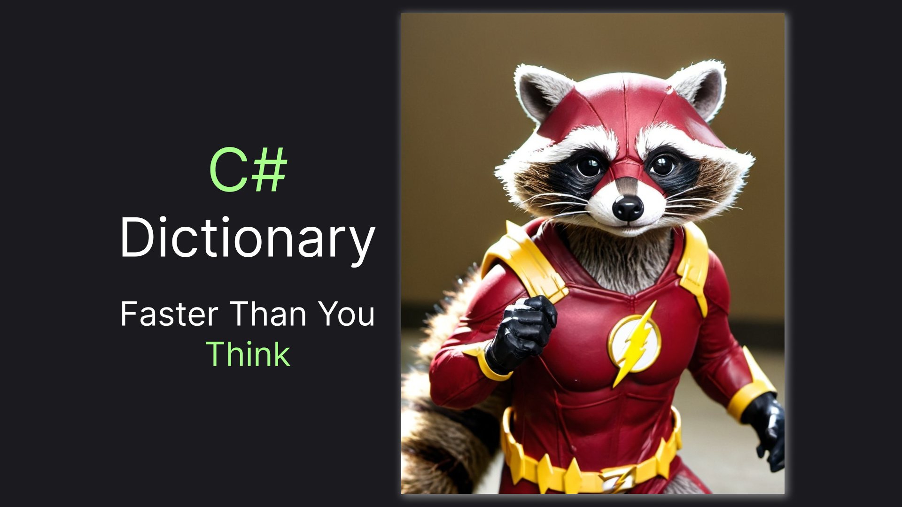

# How C# Dictionary Actually Work

`Dictionary<TKey, TValue>` is a very popular data structure in C# and a popular choice for interview questions. I've used `Dictionary` a billion times and I was pretty sure I understand how they work. However, when I delve even deeper into them and checked out the actual code I've figured out they work even better than I thought (and perhaps you, too). In this article, we'll make a deep dive together and even write our own educational replica of the dictionary. So join me and let's get going!

> Or just straight to the [Finale](#wrapping-up) for a short summary of the findings of this article!



## Making the Replica

To ensure our replica matches the actual code we'll start by exploring what we'll have in the original code and then just remove everything not essential and add logs (`Console.WriteLine`) wherever needed. It's enough to replicate just two primary methods: [Add](https://referencesource.microsoft.com/#mscorlib/system/collections/generic/dictionary.cs,a7861da7aaa500fe,references) and [GetValueOrDefault](https://referencesource.microsoft.com/#mscorlib/system/collections/generic/dictionary.cs,9680ab8ad8dfbf8d) to recreate all the essentials of the `Dictionary`, so this is what we are going to do. But first, let's check out the fields we have in a `Dictionary`:

> I'll use code from .NET Framework 4.8 from the reference source. Although modern .NET code is slightly more complicated the essentials are still the same, so the Framework version should do.

```csharp
private struct Entry {
    public int hashCode;
    public int next;
    public TKey key;
    public TValue value;
}
 
private int[] buckets;
private Entry[] entries;
private int count;
private int version;
private int freeList;
private int freeCount;
private IEqualityComparer<TKey> comparer;
```

The `freeList` and `freeCount` properties are part of an optimization technique, that is not essential for the functioning of a `Dictionary` - we'll pass on them for our replica. `version` is just a changes counter, we'll pass on it, too. For simplicity, we will also use `EqualityComparer<TKey>.Default` instead of allowing external provision. Adding methods for printing the current state (values of all the properties), we'll get:

```csharp
public class EducationalDictionary<TKey, TValue>
{
    private struct Entry {
        public int hashCode;
        public int next;
        public TKey key;
        public TValue? value;

        string ValueString => value == null ? "null" : value!.ToString()!;
        public override string ToString()
        {
            return $"{key} - {ValueString} + (next = {next})";
        }
    }
 
    private int[] buckets;
    private Entry[] entries;
    private int count;
    private readonly EqualityComparer<TKey> comparer = EqualityComparer<TKey>.Default;

    public void PrintFullState(string preface)
    {
        Console.WriteLine();
        Console.Write(this.ToString(preface));
    }

    public string ToString(string preface)
    {
        StringBuilder result = new();
        
        result.AppendLine($"{preface}, state:");
        result.AppendLine();
        result.AppendLine($"buckets: [{String.Join(", ", buckets!)}]");
        result.AppendLine($"entries:");
        for (int i = 0; i < entries.Length; i++)
        {
            result.AppendLine($" [{i}] = {entries[i]}");
        }
        result.AppendLine($"count: {count}");
        return result.ToString();
    }
}
```

The `Add` method in the source code is essentially a call to another method:

```csharp
public void Add(TKey key, TValue value) {
    Insert(key, value, true);
}
```

The `Insert` method may look scary, but don't worry, we'll dissect it bit by bit:

```csharp
private void Insert(TKey key, TValue value, bool add) {

    if( key == null ) {
        ThrowHelper.ThrowArgumentNullException(ExceptionArgument.key);
    }
 
    if (buckets == null) Initialize(0);
    int hashCode = comparer.GetHashCode(key) & 0x7FFFFFFF;
    int targetBucket = hashCode % buckets.Length;
 
#if FEATURE_RANDOMIZED_STRING_HASHING
    int collisionCount = 0;
#endif
 
    for (int i = buckets[targetBucket]; i >= 0; i = entries[i].next) {
        if (entries[i].hashCode == hashCode && comparer.Equals(entries[i].key, key)) {
            if (add) { 
                ThrowHelper.ThrowArgumentException(ExceptionResource.Argument_AddingDuplicate);
            }
            entries[i].value = value;
            version++;
            return;
        } 
 
#if FEATURE_RANDOMIZED_STRING_HASHING
                collisionCount++;
#endif
    }

    int index;
    if (freeCount > 0) {
        index = freeList;
        freeList = entries[index].next;
        freeCount--;
    }
    else {
        if (count == entries.Length)
        {
            Resize();
            targetBucket = hashCode % buckets.Length;
        }
        index = count;
        count++;
    }
 
    entries[index].hashCode = hashCode;
    entries[index].next = buckets[targetBucket];
    entries[index].key = key;
    entries[index].value = value;
    buckets[targetBucket] = index;
    version++;
 
#if FEATURE_RANDOMIZED_STRING_HASHING
 
#if FEATURE_CORECLR
    // In case we hit the collision threshold we'll need to switch to the comparer which is using randomized string hashing
    // in this case will be EqualityComparer<string>.Default.
    // Note, randomized string hashing is turned on by default on coreclr so EqualityComparer<string>.Default will 
    // be using randomized string hashing
 
    if (collisionCount > HashHelpers.HashCollisionThreshold && comparer == NonRandomizedStringEqualityComparer.Default) 
    {
        comparer = (IEqualityComparer<TKey>) EqualityComparer<string>.Default;
        Resize(entries.Length, true);
    }
#else
    if(collisionCount > HashHelpers.HashCollisionThreshold && HashHelpers.IsWellKnownEqualityComparer(comparer)) 
    {
        comparer = (IEqualityComparer<TKey>) HashHelpers.GetRandomizedEqualityComparer(comparer);
        Resize(entries.Length, true);
    }
#endif // FEATURE_CORECLR
 
#endif 
}
```

It also calls another methods:

```csharp
private void Initialize(int capacity) {
    int size = HashHelpers.GetPrime(capacity);
    buckets = new int[size];
    for (int i = 0; i < buckets.Length; i++) buckets[i] = -1;
    entries = new Entry[size];
    freeList = -1;
}
```

```csharp
private void Resize(int newSize, bool forceNewHashCodes) {
    Contract.Assert(newSize >= entries.Length);
    int[] newBuckets = new int[newSize];
    for (int i = 0; i < newBuckets.Length; i++) newBuckets[i] = -1;
    Entry[] newEntries = new Entry[newSize];
    Array.Copy(entries, 0, newEntries, 0, count);
    if(forceNewHashCodes) {
        for (int i = 0; i < count; i++) {
            if(newEntries[i].hashCode != -1) {
                newEntries[i].hashCode = (comparer.GetHashCode(newEntries[i].key) & 0x7FFFFFFF);
            }
        }
    }
    for (int i = 0; i < count; i++) {
        if (newEntries[i].hashCode >= 0) {
            int bucket = newEntries[i].hashCode % newSize;
            newEntries[i].next = newBuckets[bucket];
            newBuckets[bucket] = i;
        }
    }
    buckets = newBuckets;
    entries = newEntries;
}
```

And finally, they, call methods on `HashHelpers`. We'll replicate those since they are very trivial if you don't handle edge cases. Here's what our version will look like:

```csharp
public static class HashHelpers
{
    public static readonly int[] primes = {
        3, 7, 11, 17, 23, 29, 37, 47, 59, 71, 89, 107, 131, 163, 197, 239, 293, 353, 431, 521, 631, 761, 919,
        1103, 1327, 1597, 1931, 2333, 2801, 3371, 4049, 4861, 5839, 7013, 8419, 10103, 12143, 14591,
        17519, 21023, 25229, 30293, 36353, 43627, 52361, 62851, 75431, 90523, 108631, 130363, 156437,
        187751, 225307, 270371, 324449, 389357, 467237, 560689, 672827, 807403, 968897, 1162687, 1395263,
        1674319, 2009191, 2411033, 2893249, 3471899, 4166287, 4999559, 5999471, 7199369};
    
    public static int GetPrime(int min)
    {
        foreach (var prime in primes)
        {
            if (prime >= min) return prime;
        }

        return min;
    }
    
    public static int ExpandPrime(int oldSize)
    {
        return GetPrime(2 * oldSize);
    }
}
```

For resize we'll remove the logic after `if (forceNewHashCodes)` and print state after the resizing is done. To be honest, the code is not very important it essentially rearranges `entries` and `buckets` for the new size. This is what our result looks like:

```csharp
private void Resize(int newSize) {
    var newBuckets = new int[newSize];
    for (var i = 0; i < newBuckets.Length; i++) newBuckets[i] = -1;
    var newEntries = new Entry[newSize];
    Array.Copy(entries, 0, newEntries, 0, count);

    for (var i = 0; i < count; i++) {
        if (newEntries[i].hashCode >= 0) {
            var bucket = newEntries[i].hashCode % newSize;
            newEntries[i].next = newBuckets[bucket];
            newBuckets[bucket] = i;
        }
    }

    buckets = newBuckets;
    entries = newEntries;
    
    PrintFullState("\u2194\ufe0f Resize");
}
```

We'll move initialization logic from `if (buckets == null) Initialize(0);` straight to the constructor (since it will nullability handling much easier):

> Along with the printing state after the initialization is done

```csharp
public EducationalDictionary()
{
    var size = HashHelpers.GetPrime(0);
    buckets = new int[size];
    for (var i = 0; i < buckets.Length; i++) buckets[i] = -1;
    entries = new Entry[size];
    
    PrintFullState("\ud83d\ude80 Initialized");
}
```

For the `Add` here's the list of changes we'll perform:

- Remove arguments validation
- Remove everything under `#FEATURE_RANDOMIZED_STRING_HASHING`
- Remove logic under `if (freeCount > 0)` since we removed the parameter anyway
- Remove the loop, checking for already set keys: `for (int i = buckets[targetBucket]; i >= 0; i = entries[i].next) {`
- Print state after the addition

```csharp
public void Add(TKey key, TValue value) {
    var hashCode = comparer.GetHashCode(key) & 0x7FFFFFFF;
    var targetBucket = hashCode % buckets!.Length;
    
    if (count == entries!.Length)
    {
        Resize(HashHelpers.ExpandPrime(count));
        targetBucket = hashCode % buckets.Length;
    }
    
    var index = count;
    count++;
    
    entries[index].hashCode = hashCode;
    entries[index].next = buckets[targetBucket];
    entries[index].key = key;
    entries[index].value = value;
    buckets[targetBucket] = index;
    
    Console.WriteLine();
    PrintFullState($"\ud83d\udce5 Add: {key} - {value}. hashCode = {hashCode}, targetBucket = {targetBucket}");
}
```

Looks way simpler now, right? Now let's finalize our class, implementing `GetValueOrDefault`.

## Getting the value

This time the implementation is rather simple even in the original code of `GetValueOrDefault`:

```csharp
internal TValue GetValueOrDefault(TKey key) {
    int i = FindEntry(key);
    if (i >= 0) {
        return entries[i].value;
    }
    return default(TValue);
}
```

And in the search itself (in the `FindEntry` method):

```csharp
private int FindEntry(TKey key) {
    if( key == null) {
        ThrowHelper.ThrowArgumentNullException(ExceptionArgument.key);
    }
 
    if (buckets != null) {
        int hashCode = comparer.GetHashCode(key) & 0x7FFFFFFF;
        for (int i = buckets[hashCode % buckets.Length]; i >= 0; i = entries[i].next) {
            if (entries[i].hashCode == hashCode && comparer.Equals(entries[i].key, key)) return i;
        }
    }
    return -1;
}
```

There's not much to clean up here. But we will add a lot of logs, since it's the essential

```csharp
private int FindEntry(TKey key)
{
    var hashCode = comparer.GetHashCode(key!) & 0x7FFFFFFF;
    var initialBucketIndex = hashCode % buckets.Length;
    
    Console.WriteLine();
    Console.WriteLine($"\ud83d\udd0e Search. Key = {key}. Initial Bucket Index {initialBucketIndex}");
    
    for (var i = buckets[initialBucketIndex]; i >= 0; i = entries[i].next)
    {
        Console.WriteLine();
        Console.WriteLine($"Comparing key from entries[{i}] ({entries[i]}) to {key}");
        
        if (entries[i].hashCode == hashCode && comparer.Equals(entries[i].key, key))
        {
            Console.WriteLine($"Key is equal returning {i}");
            
            return i;
        }
        else {
            Console.WriteLine($"Key is not equal, moving to the next linked index ({entries[i].next})");
        }
    }
    
    Console.WriteLine();
    Console.WriteLine("Search exit condition met (i >= 0). Returning -1 (as not found)");
    return -1;
}
```

This finishes up our `EducationalDictionary`. Now let's use it and see the detailed logs we've prepared!

## Performing the tests

We'll add 4 records, search for each of this record, plus one non-existing key, which should return `null`, indicating that it couldn't find it. Here's how the test might look like:

```csharp
[TestMethod]
public void FindsMultipleKeys()
{
    var dict = new EducationalDictionary<int, string>();
    dict.Add(48, "John");
    dict.Add(34, "Josh");
    dict.Add(22, "Jack");
    dict.Add(11, "Alex");

    dict.GetValueOrDefault(48).Should().Be("John");
    dict.GetValueOrDefault(34).Should().Be("Josh");
    dict.GetValueOrDefault(22).Should().Be("Jack");
    dict.GetValueOrDefault(11).Should().Be("Alex");
    dict.GetValueOrDefault(50).Should().Be(null);
}
```

And this is the log we'll get from running the test:

```yaml
🚀 Initialized, state:

buckets: [-1, -1, -1]
entries:
 [0] = 0 - null + (next = 0)
 [1] = 0 - null + (next = 0)
 [2] = 0 - null + (next = 0)
count: 0


📥 Add: 48 - John. hashCode = 48, targetBucket = 0, state:

buckets: [0, -1, -1]
entries:
 [0] = 48 - John + (next = -1)
 [1] = 0 - null + (next = 0)
 [2] = 0 - null + (next = 0)
count: 1


📥 Add: 34 - Josh. hashCode = 34, targetBucket = 1, state:

buckets: [0, 1, -1]
entries:
 [0] = 48 - John + (next = -1)
 [1] = 34 - Josh + (next = -1)
 [2] = 0 - null + (next = 0)
count: 2


📥 Add: 22 - Jack. hashCode = 22, targetBucket = 1, state:

buckets: [0, 2, -1]
entries:
 [0] = 48 - John + (next = -1)
 [1] = 34 - Josh + (next = -1)
 [2] = 22 - Jack + (next = 1)
count: 3

↔️ Resize, state:

buckets: [-1, 2, -1, -1, -1, -1, 1]
entries:
 [0] = 48 - John + (next = -1)
 [1] = 34 - Josh + (next = 0)
 [2] = 22 - Jack + (next = -1)
 [3] = 0 - null + (next = 0)
 [4] = 0 - null + (next = 0)
 [5] = 0 - null + (next = 0)
 [6] = 0 - null + (next = 0)
count: 3


📥 Add: 11 - Alex. hashCode = 11, targetBucket = 4, state:

buckets: [-1, 2, -1, -1, 3, -1, 1]
entries:
 [0] = 48 - John + (next = -1)
 [1] = 34 - Josh + (next = 0)
 [2] = 22 - Jack + (next = -1)
 [3] = 11 - Alex + (next = -1)
 [4] = 0 - null + (next = 0)
 [5] = 0 - null + (next = 0)
 [6] = 0 - null + (next = 0)
count: 4

🔎 Search. Key = 48. Initial Bucket Index 6

Comparing key from entries[1] (34 - Josh + (next = 0)) to 48
Key is not equal, moving to the next linked index (0)

Comparing key from entries[0] (48 - John + (next = -1)) to 48
Key is equal returning 0

🔎 Search. Key = 34. Initial Bucket Index 6

Comparing key from entries[1] (34 - Josh + (next = 0)) to 34
Key is equal returning 1

🔎 Search. Key = 22. Initial Bucket Index 1

Comparing key from entries[2] (22 - Jack + (next = -1)) to 22
Key is equal returning 2

🔎 Search. Key = 11. Initial Bucket Index 4

Comparing key from entries[3] (11 - Alex + (next = -1)) to 11
The key is equal returning 3

🔎 Search. Key = 50. Initial Bucket Index 1

Comparing key from entries[2] (22 - Jack + (next = -1)) to 50
Key is not equal, moving to the next linked index (-1)

Search exit condition met (i >= 0). Returning -1 (as not found)
```

With code and logs in place let's put in words what we found out about for a `Dictionary` works.

## Wrapping Up!

With the code and logs above we can explain how a `Dictionary` searches for values:

1. A `Dictionary` stores a set of `buckets` and `entries`.
1. Index of a bucket - `i` - is calculated based on the hash code of the key.
1. The value of the `bucket[i]` contains the index of a record in `entries`
1. The matching entry either matches the key or has another entry in the links chain that does (or the key doesn't exist in a dictionary)
1. To find the actual value `Dictionary` cycles by the links until it finds a matching key or stops at the dead-end (`0` or `-1` in `next`).

With the algorithm, both search and insert operations are pretty fast and don't require much memory! To play around with the `EducationalDictionary` yourself check out the source code [here](https://github.com/astorDev/seege/tree/main/dictionary/playground). And by the way ... claps are appreciated 👏
